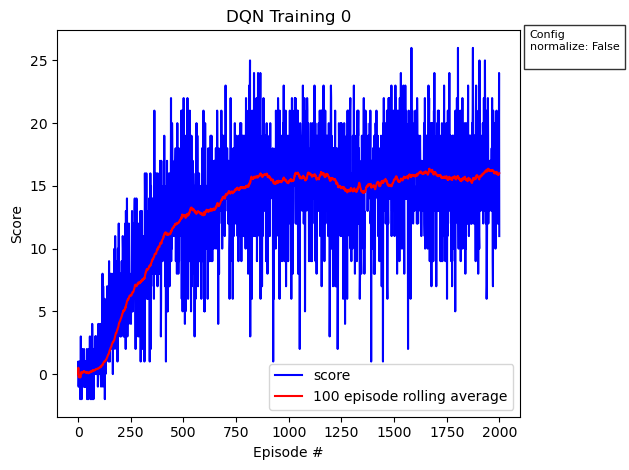

# Report on Udacity Deep Reinforcement Learning (DRL) nanodegree, Project 1: Yellow / Blue Bananas
## Hani Salah - April 2025

# Introduction
This report is intended to describe how a script is built to solve the yellow / blue banana environment described in the [README.md](./README.md)

The script is built to be as autonomous as possible, and the user is free to add any additional experiments of his choosing.

The script entry point is [Navigation.py](./Navigation.py) and it is a simple function call to ```DQN_main()```

# Approach
This project implementation is intended to address different DQN network architectures. The reasoning for using each of which is briefly described in each related section.
The variants addressed are:
1. Vanilla DQN (named DQN in the script)
2. Double DQN (named DDQN in the script)
3. Prioritized Experience Replay (named PER in the script)
4. Dueling DQN (named DuDQN in the script)

For each network variant, the related files are located as follows:
1. Experience Replay is defined in [ReplayBuffer](./ReplayBuffer)
2. The Deep Network Model is defined in [Models](./Models)
3. The Agent definition in [Agents](./Agents)

The various experiments are defined in [Navigation.py](./Navigation.py) under the ```params``` variable. Each experiment is a ```dict``` with its ```key``` as the network name, and the ```value``` is another ```dict``` that contains whatever hyperparameters that we want to experiment, with empty ```dict``` means to run with default parameters.

All default hyperparameters are defined in each respective ```Agent``` class under [Agents](./Agents) except for ```eps_end``` and ```episode``` which are defined in the same [Navigation.py](./Navigation.py).

Each experiment when run, saves its model weights to the correct file in [Checkpoints](./Checkpoints) and saves the scores / average scores in a dataframe ```.csv```, with the relevant plot ```.png``` in [Visualizations](./Visualizations).

Subsequent runs to the script, correlate the saved models / visualizations with the ```params``` experiment list and skips whatever is already available. If you want to re-run the same experiments again, rename or delete the [Checkpoints](./Checkpoints) and [Visualizations](./Visualizations) folders and create new empty folders with the same name.

# Default Parameters
The initial default hyperparameters are defined in the relevant [agent.py](./Agents) as shown below. Each experiment uses the default parameters except those overridden by the ```params``` specification in [Navigation.py](./Navigation.py)

The default hyperparameters are:

| Parameter    | Value | Applicable Network(s) |
|--------------|-------|-----------------------|
| buffer_size  | 1e5   | DQN, DDQN, PER        |
| batch_size   | 64    | DQN, DDQN, PER        |
| gamma        | 0.99  | DQN, DDQN, PER        |
| tau          | 1e-3  | DQN, DDQN, PER        |
| lr           | 5e-4  | DQN, DDQN, PER        |
| update_every | 4     | DQN, DDQN, PER        |
| fc1          | 64    | DQN, DDQN, PER        |
| fc2          | 64    | DQN, DDQN, PER        |
| eps_end      | 0.01  | DQN, DDQN, PER        |
| episode      | 2000  | DQN, DDQN, PER        |
| alpha        | 0.6   | PER                   |
| beta         | 0.4   | PER                   |

# Input Normalization
There is very little information provided on the ```state``` of the environment. We only know that it has 37 dimensions, but no information about the ranges or whether the dimensions are normalized.
After we tried multiple experiments (reported below), we could identify a stalling pattern of learning past ~1000 episodes.
We tried to look on one of the ```states``` returned from the environment, and it showed that at least one input dimension is way off in terms of value / scale from the other dimensions.
We figured out that this behavior would need input normalization to the RL models. 
However, as we don't know the mean / std deviation of the environment states, we need to introduce an input normalization layer in the model, where we had two choices; either to use ```nn.BatchNorm1D()``` or ```nn.LayerNorm()```.
Since ```nn.BatchNorm1d()``` behave differently between training and evaluation, we elect to use ```nn.LayerNorm()```.
We introduced the ```nn.LayerNorm()``` to the model through a boolean flag in the model initiation. It is always set to True, but to replicate the very first model result (vanilla DQN with default parameters), we specifically set this flag to False.

# Vanilla DQN (DQN):
## Experiment 0:
This experiment runs on the default parameters without change (except for setting the layer normalization to False).
The model trained for 2000 episodes, achieved average score of 13 for 100 episodes after ~600 episodes.



The model then plays for another 2000 episodes without training to check how the model is performing in playing the environment.


## Experiment 1:
We notice in Experiment 0 training that training almost stalls after ~800 episodes. So we set normalization to True (the real default afterwards).
The model trained for 2000 episodes, achieved average score of 13 for 100 episodes after ~500 episodes. Also, training stall is not as agressive as before.


The model then plays for another 2000 episodes without training to check how the model is performing in playing the environment.


# Double DQN (DDQN)
DQNs are famous of systematic overestimation of action values, giving rise to Double DQNs (DDQNs).
To easily understand why DQNs suffer systematic overestimation, let's assume we have a population of 100 person. Each person weighs exactly 80 KG. Let's say we use a scale that can be off by +/- 1 KG to weigh every person, and report the maximum weight we measure.
Considering this simple experiment, it is almost always the case that the reported maximum weight will be larger than the real person weight, which is an overestimation.
In DQNs this overestimation occurs due to using the ```argmax``` function in reporting the action values.
Now to counter this, say we measure the population weights in the example twice. And we use the first measurement of all persons to report the index of the person having the maximum weight (from the first measurement), then use this index to get that person's weight from the second measurement.
Due to the distribution of the scale's error in both cases, we are more likely to have weights closer to the real weights of the persons.
This is shown in DDQN by using the target network a bit differently. We estimate the actions based on the ```argmax``` from the local network actions, and use this action to select the equivalent action value from the target network.
This is why it is called Double DQN, because we are using two different networks, one for action estimation, and another for action value estimation.

## Experiment 2:
In addition to implementing DDQN, we elected to increase the buffer size and widen the model to improve the performance (faster convergence, and higher scores).

| Parameter   | Value |
|-------------|-------|
| buffer_size | 2e5   |
| fc1         | 256   |
| fc2         | 128   |

The model trained for 2000 episodes, achieved average score of 13 for 100 episodes after ~500 episodes.
While the above didn't resolve the stalling, it resulted in faster convergence and higher average scores.


The model then plays for another 2000 episodes without training to check how the model is performing in playing the environment.


# Priority Experience Replay (PER)
For both Vanilla DQN and DDQN, sampling experiences have been done following uniform sampling from the replay buffer. Experiences with higher priority are dealt with in the same manner as those with lower or negligible impact.
PER solves this by prioritizing the experience, selecting from experiences based on those priorities, and adjusts the loss function by an 'importance sampling weight' factor to counter the bias introduced by sampling more higher priorities experiences.

Computing priorities can be efficiently achieved using a data structure called **SumTree** with a python native implementation adapted from [here](https://github.com/Howuhh/prioritized_experience_replay). **SumTree** data structure is explained for example [here](https://www.sefidian.com/2022/11/09/sumtree-data-structure-for-prioritized-experience-replay-per-explained-with-python-code/).

PER also requires two more hyperparameters; ```alpha``` and ```beta```. ```alpha``` controls the tendency to use priorities over uniform sampling from experiences. ```beta``` corrects the model error to offset the non uniform sampling encountered when sampling from experiences based on priority.

We tried ```beta``` as a flat number throughout the training episode, and we also explored ```beta``` annealing. However, ```beta``` annealing provided results worse than expected, and as such is not reported below.

The use of PER also requires substantial increase in the replay buffer size to accomodate meaningful experience prioritizing.

Finally, we found that starting training on empty experiences actually penalized the training score since the model is untrained in the beginning it adds high priorities to random unprioritized experiences. So prefilling ~10% of our replay buffer before training helped the training and made it on par with the previous networks.

## Experiment 3:
Considering all the above, we run a PER DDQN experiment, considering also a wider model to try to learn better function approximation. We didn't elect for deeper models to avoid running into other issues such as batch normalizations and exploding or vanashing gradients.
The model trained for 2000 episodes, achieved average score of 13 for 100 episodes after ~600 episodes.

| Parameter   | Value |
|-------------|-------|
| buffer_size | 1e6   |
| fc1         | 256   |
| fc2         | 128   |
| alpha       | 0.6   |
| beta        | 0.4   |


The model then plays for another 2000 episodes without training to check how the model is performing in playing the environment.


# Dueling DQN (DuDQN)

In our opinion, PER is not suitable for the environment at hand, since the state dimensions represent ray tracing perception, which in turn is random. As such, experiences are not likely to be repeatable and consequently prioritizing them is of limited use.

So while the intention is to build each experiment on top of the previous one, we discard the PER from our stack.

We here build a Dueling DQN on top of DDQN instead of PER.

In Dueling DQN, the idea is that the model is split into two streams, a value stream (v) and an action stream (a).
The idea behind this segregation is that the model tries to predict which series of actions would have more probability in raising the Q-value, and when knowing it, adding it to the value of the current state helps converge the model faster by not spending time on actions that would not result in increasing the Q-Value.

## Experiment 4
In this experiment we built a Dueling DQN on top of DDQN.
The model trained for 2000 episodes, achieved average score of 13 for 100 episodes after ~485 episodes.

| Parameter   | Value |
|-------------|-------|
| buffer_size | 2e5   |
| fc1         | 256   |
| fc2         | 128   |


The model then plays for another 2000 episodes without training to check how the model is performing in playing the environment.


# Network Comparison

The 100-Episode rolling average for each of the above experiments are combined in a single graph to visualize differences between different implementations.


